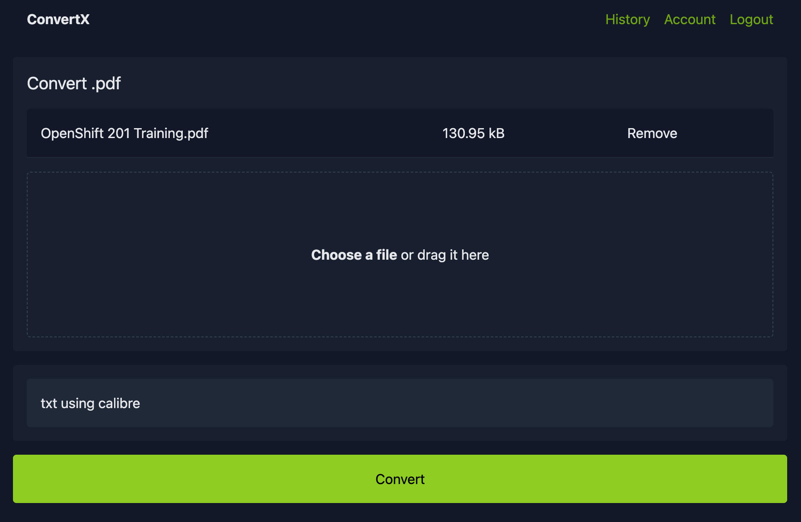
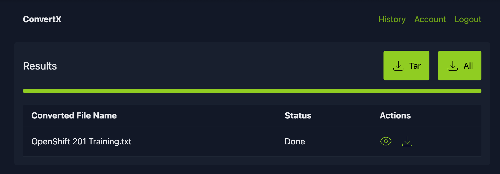

# ConvertX Demo

This demo showcases how to deploy a local **ConvertX** container for private, file conversions. No more ads or daily limits.

**ConvertX** is a self-hosted online file converter that supports over a thousand different formats. 

---

## Run the container

```bash
podman-compose up -d
```

Open http://localhost:3000 in your web browser and create an account with any dummy email and password. It's local so it doesn't matter!

---

## Demo - Converting Files

1. Upload the file.


2. Select the desired file format.



All conversions are stored at your mount point as uploads and output.

```bash
data/uploads/1/5:
-rw-r--r--  1 staff  staff  134092 Oct 21 22:17 OpenShift 201 Training.pdf

data/output/1/5:
-rw-r--r--  1 staff  staff  138008509 Oct 21 22:18 OpenShift 201 Training.txt
```